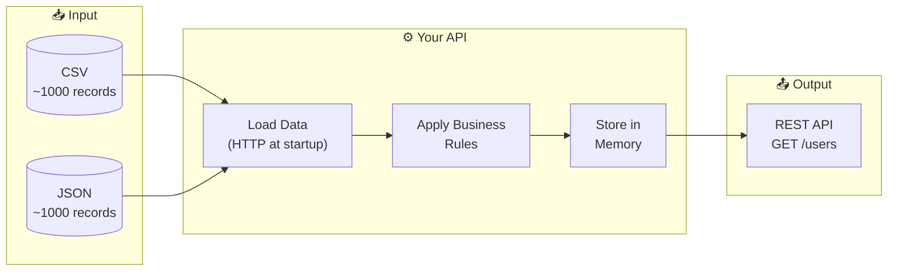
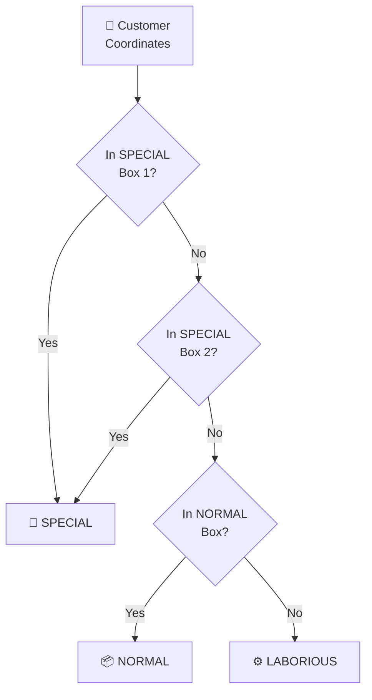
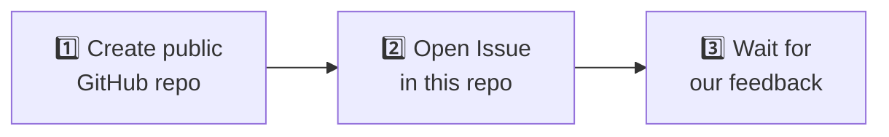

<p align="center">
  
</p>

<h1 align="center">&lt;backend-challenge /&gt;</h1>

<p align="center">
  <strong>Build a REST API • Transform Data • Document Your AI Journey</strong>
</p>

<p align="center">
  <a href="./README.pt-BR.md">🇧🇷 Leia em Português</a>
</p>

<p align="center">
  
  
  
  
</p>

---

## 🎯 What We're Looking For

The main objective of this challenge is to assess your approach to **problem-solving, code quality, and how you leverage AI tools** in your development workflow.

<table>
<tr>
<td>✅</td><td>Your coding style and organization</td>
</tr>
<tr>
<td>✅</td><td>Decision-making and trade-offs</td>
</tr>
<tr>
<td>✅</td><td>Testing strategies</td>
</tr>
<tr>
<td>✅</td><td>Documentation quality</td>
</tr>
<tr>
<td>✅</td><td>How you collaborate with AI tools</td>
</tr>
</table>

> [!IMPORTANT]
> 🤖 **AI collaboration is mandatory.** We don't want to know *if* you used AI. We want to know *how* you used it. Document your journey!

---

## 📑 Table of Contents

- [🚀 The Challenge](#-the-challenge)
- [📋 Business Rules](#-business-rules)
- [🔌 API Requirements](#-api-requirements)
- [⭐ Evaluation Criteria](#-evaluation-criteria)
- [🤖 AI Journey (Required)](#-ai-journey-required)
- [📤 Submission](#-submission)
- [❓ FAQ](#-faq)

---

## 🚀 The Challenge

We receive customer data from partner companies in both **CSV** and **JSON** formats. Your mission:



### 📥 Input Data

| Format | URL | Records |
|:------:|-----|:-------:|
| 📄 CSV | [input-backend.csv](https://storage.googleapis.com/juntossomosmais-code-challenge/input-backend.csv) | ~1000 |
| 📋 JSON | [input-backend.json](https://storage.googleapis.com/juntossomosmais-code-challenge/input-backend.json) | ~1000 |

> [!WARNING]
> Data must be loaded via HTTP request **at startup** and kept **in memory**. No database required.

---

## 📋 Business Rules

### 1️⃣ Customer Classification by Location

Based on coordinates, classify each customer into regions:



<details>
<summary>📍 <b>Click to see Bounding Box coordinates</b></summary>

| Type | MinLon | MinLat | MaxLon | MaxLat |
|:----:|--------|--------|--------|--------|
| 🌟 **SPECIAL** | -2.196998 | -46.361899 | -15.411580 | -34.276938 |
| 🌟 **SPECIAL** | -19.766959 | -52.997614 | -23.966413 | -44.428305 |
| 📦 **NORMAL** | -26.155681 | -54.777426 | -34.016466 | -46.603598 |
| ⚙️ **LABORIOUS** | Anyone not matching the above |

</details>

### 2️⃣ Data Transformations

| Field | Transformation | Example |
|-------|----------------|---------|
| 📞 `phone`, `cell` | Convert to [E.164](https://en.wikipedia.org/wiki/E.164) | `(86) 8370-9831` → `+558683709831` |
| 👤 `gender` | Abbreviate | `male` → `M`, `female` → `F` |
| 🗑️ `dob.age`, `registered.age` | Remove these fields | — |
| 🇧🇷 `nationality` | Add field | `BR` |
| 🗺️ `region` | Add based on state | Norte, Nordeste, Centro-Oeste, Sudeste, Sul |

### 3️⃣ Output Contract

<details>
<summary>📄 <b>Click to see the expected JSON structure</b></summary>

```json
{
  "type": "laborious",
  "gender": "M",
  "name": {
    "title": "mr",
    "first": "quirilo",
    "last": "nascimento"
  },
  "location": {
    "region": "sul",
    "street": "680 rua treze",
    "city": "varginha",
    "state": "paraná",
    "postcode": 37260,
    "coordinates": {
      "latitude": "-46.9519",
      "longitude": "-57.4496"
    },
    "timezone": {
      "offset": "+8:00",
      "description": "Beijing, Perth, Singapore, Hong Kong"
    }
  },
  "email": "quirilo.nascimento@example.com",
  "birthday": "1979-01-22T03:35:31Z",
  "registered": "2005-07-01T13:52:48Z",
  "telephoneNumbers": ["+556629637520"],
  "mobileNumbers": ["+553270684089"],
  "picture": {
    "large": "https://randomuser.me/api/portraits/men/83.jpg",
    "medium": "https://randomuser.me/api/portraits/med/men/83.jpg",
    "thumbnail": "https://randomuser.me/api/portraits/thumb/men/83.jpg"
  },
  "nationality": "BR"
}
```

</details>

---

## 🔌 API Requirements

### Endpoint

```http
GET /users
```

### Query Parameters

| Parameter | Type | Description |
|-----------|:----:|-------------|
| `region` | `string` | Filter by region: `norte`, `nordeste`, `centro-oeste`, `sudeste`, `sul` |
| `type` | `string` | Filter by classification: `special`, `normal`, `laborious` |
| `pageNumber` | `int` | Page number (1-indexed) |
| `pageSize` | `int` | Items per page |

### Response Format

```json
{
  "pageNumber": 1,
  "pageSize": 10,
  "totalCount": 2000,
  "users": [...]
}
```

### ✅ Validation

Your API must pass our validation script:

```bash
./validate.sh
```

This checks:
- ✓ Endpoint responding at `localhost:8080`
- ✓ Pagination fields present
- ✓ Total count of 2000 records

---

## ⭐ Evaluation Criteria

We assess your submission across **7 competencies**. There are no "levels" to choose — just deliver your best work, and we'll evaluate where you stand.

<table>
<tr>
<td width="50%">

### 🎯 Problem Solving
- Correct implementation of all business rules
- Edge cases handling (invalid data, missing fields)
- Logical and efficient data transformation

### 🏗️ Code Architecture
- Clear separation of concerns
- Consistent project structure
- Appropriate design patterns (when they add value)
- Easy to navigate and understand

### ✨ Code Quality
- Readability over cleverness
- Meaningful naming conventions
- Consistent style throughout
- Proper error handling

### 🧪 Testing
- Tests that document behavior
- Coverage of critical paths
- Tests that catch real bugs
- Balance of unit and integration tests

</td>
<td width="50%">

### 📚 Documentation
- Clear README with setup instructions
- API documentation (any format)
- Comments where code isn't self-explanatory
- Architecture decisions explained

### 🚀 Production Readiness
- Containerization (Docker)
- Environment configuration
- Health checks
- Logging strategy
- CI/CD awareness

### 🤖 AI Collaboration
- Transparency in AI usage
- Critical thinking about AI-generated code
- Iteration and refinement over copy-paste
- Understanding of what the AI produced

</td>
</tr>
</table>

---

## 🤖 AI Journey (Required)

> [!CAUTION]
> This section is **mandatory**. Submissions without AI documentation will not be evaluated.

Create an `/ai-journey` folder in your repository documenting how you collaborated with AI tools.

### 📁 Required Structure

```
📁 ai-journey/
├── 📄 README.md          # Summary of your AI usage
├── 📄 prompts.md         # Key prompts you used
└── 📄 learnings.md       # What you learned in the process
```

### 📝 What to Document

#### `prompts.md` — The interesting parts, not everything

```markdown
## 🔧 Prompt: Phone number regex
**Tool:** ChatGPT-4 / Claude / Copilot

**What I asked:**
"Create a regex to convert Brazilian phone numbers to E.164 format"

**What happened:**
Initial regex didn't handle 9-digit mobile numbers. I had to...

**Final solution:**
[your code]
```

#### `learnings.md` — Reflect on the experience

```markdown
## ✅ What worked well
- AI was great for boilerplate code
- Helped me explore unfamiliar libraries

## ❌ What didn't work
- Initial architecture suggestion was over-engineered
- Had to simplify after understanding actual requirements

## 🔄 What I'd do differently
- Start with clearer requirements in prompts
- Ask for simpler solutions first
```

---

## 📤 Submission

### 💻 Languages

<p>

<b>or</b>

</p>

Choose the one you're most comfortable with.

### 📁 Repository Structure

```
📁 your-repo/
├── 📂 src/                  # Source code
├── 📂 tests/                # Tests
├── 📂 ai-journey/           # AI documentation (required!)
│   ├── 📄 README.md
│   ├── 📄 prompts.md
│   └── 📄 learnings.md
├── 🐳 docker-compose.yml    # If applicable
└── 📄 README.md             # Setup instructions
```

### 📮 How to Submit



**Issue format:**
- **Title:** `[Backend] Your Name`
- **Content:** Link to your repository + brief description

### ⏰ Timeline

| Recommended | Need more time? |
|:-----------:|:---------------:|
| 7 days | Just let us know in the issue! |

---

## ❓ FAQ

<details>
<summary><b>🔤 What languages can I use?</b></summary>

**Python** or **C#**. Choose the one you're most comfortable with.
</details>

<details>
<summary><b>💼 Are there open positions?</b></summary>

Not always, but we maintain a talent pool. Great submissions stay on our radar for future opportunities.
</details>

<details>
<summary><b>⚠️ What if I can only complete part of the challenge?</b></summary>

Submit what you have! Partial submissions with quality code tell us more than complete submissions with poor code. Just document what's missing and why.
</details>

<details>
<summary><b>➕ Should I include extra features?</b></summary>

Only if they add clear value and don't compromise core requirements. We prefer well-executed basics over half-finished extras.
</details>

<details>
<summary><b>📊 How will I know my seniority level?</b></summary>

We don't ask you to self-declare a level. We evaluate your submission across all criteria and determine fit based on our internal standards.
</details>

---

## 🔗 Other Challenges

| Position | Repository |
|----------|------------|
| 🎨 Frontend | [frontend-challenge](https://github.com/juntossomosmais/frontend-challenge) |

---

## 💬 Questions?

<p>
  <a href="../../issues">📋 Open an Issue</a>
  &nbsp;•&nbsp;
  <a href="mailto:vagas-dev@juntossomosmais.com.br">✉️ vagas-dev@juntossomosmais.com.br</a>
</p>

> Before asking, check if your question was already answered in [previous issues](../../issues?q=is%3Aissue).

---

<p align="center">
  <sub>Made with 💛 by the Engineering Team at <a href="https://juntossomosmais.com.br">Juntos Somos Mais</a></sub>
</p>
