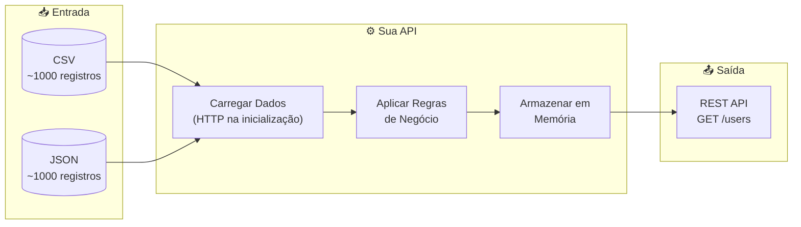
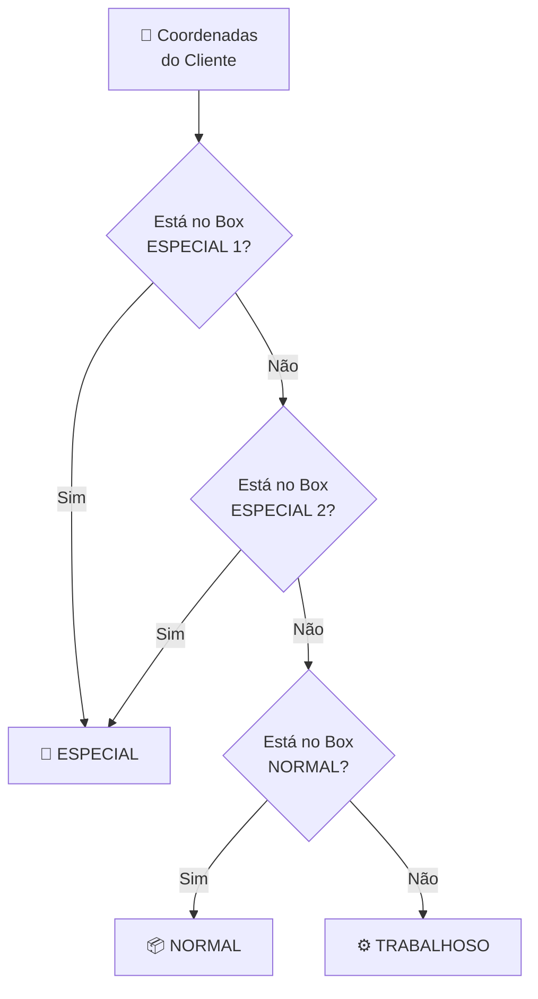
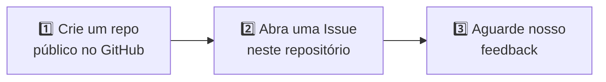

<p align="center">
  
</p>

<h1 align="center">&lt;backend-challenge /&gt;</h1>

<p align="center">
  <strong>Construa uma API REST • Transforme Dados • Documente sua Jornada com IA</strong>
</p>

<p align="center">
  <a href="./README.md">🇺🇸 Read in English</a>
</p>

<p align="center">
  
  
  
  
</p>

---

## 🎯 O Que Buscamos

O principal objetivo deste desafio é avaliar sua abordagem para **resolução de problemas, qualidade de código e como você utiliza ferramentas de IA** no seu fluxo de desenvolvimento.

<table>
<tr>
<td>✅</td><td>Seu estilo de código e organização</td>
</tr>
<tr>
<td>✅</td><td>Tomada de decisão e trade-offs</td>
</tr>
<tr>
<td>✅</td><td>Estratégias de teste</td>
</tr>
<tr>
<td>✅</td><td>Qualidade da documentação</td>
</tr>
<tr>
<td>✅</td><td>Como você colabora com ferramentas de IA</td>
</tr>
</table>

> [!IMPORTANT]
> 🤖 **Colaboração com IA é obrigatória.** Não queremos saber *se* você usou IA. Queremos saber *como* você usou. Documente sua jornada!

---

## 📑 Índice

- [🚀 O Desafio](#-o-desafio)
- [📋 Regras de Negócio](#-regras-de-negócio)
- [🔌 Requisitos da API](#-requisitos-da-api)
- [⭐ Critérios de Avaliação](#-critérios-de-avaliação)
- [🤖 Jornada IA (Obrigatório)](#-jornada-ia-obrigatório)
- [📤 Entrega](#-entrega)
- [❓ FAQ](#-faq)

---

## 🚀 O Desafio

Recebemos dados de clientes de empresas parceiras nos formatos **CSV** e **JSON**. Sua missão:



### 📥 Dados de Entrada

| Formato | URL | Registros |
|:-------:|-----|:---------:|
| 📄 CSV | [input-backend.csv](https://storage.googleapis.com/juntossomosmais-code-challenge/input-backend.csv) | ~1000 |
| 📋 JSON | [input-backend.json](https://storage.googleapis.com/juntossomosmais-code-challenge/input-backend.json) | ~1000 |

> [!WARNING]
> Os dados devem ser carregados via requisição HTTP **na inicialização** e mantidos **em memória**. Não é necessário banco de dados.

---

## 📋 Regras de Negócio

### 1️⃣ Classificação de Clientes por Localização

Baseado nas coordenadas, classificar cada cliente em regiões:



<details>
<summary>📍 <b>Clique para ver as coordenadas dos Bounding Boxes</b></summary>

| Tipo | MinLon | MinLat | MaxLon | MaxLat |
|:----:|--------|--------|--------|--------|
| 🌟 **ESPECIAL** | -2.196998 | -46.361899 | -15.411580 | -34.276938 |
| 🌟 **ESPECIAL** | -19.766959 | -52.997614 | -23.966413 | -44.428305 |
| 📦 **NORMAL** | -26.155681 | -54.777426 | -34.016466 | -46.603598 |
| ⚙️ **TRABALHOSO** | Qualquer um que não se encaixe nas regras acima |

</details>

### 2️⃣ Transformações de Dados

| Campo | Transformação | Exemplo |
|-------|---------------|---------|
| 📞 `phone`, `cell` | Converter para [E.164](https://en.wikipedia.org/wiki/E.164) | `(86) 8370-9831` → `+558683709831` |
| 👤 `gender` | Abreviar | `male` → `M`, `female` → `F` |
| 🗑️ `dob.age`, `registered.age` | Remover estes campos | — |
| 🇧🇷 `nationality` | Adicionar campo | `BR` |
| 🗺️ `region` | Adicionar baseado no estado | Norte, Nordeste, Centro-Oeste, Sudeste, Sul |

### 3️⃣ Contrato de Saída

<details>
<summary>📄 <b>Clique para ver a estrutura JSON esperada</b></summary>

```json
{
  "type": "laborious",
  "gender": "M",
  "name": {
    "title": "mr",
    "first": "quirilo",
    "last": "nascimento"
  },
  "location": {
    "region": "sul",
    "street": "680 rua treze",
    "city": "varginha",
    "state": "paraná",
    "postcode": 37260,
    "coordinates": {
      "latitude": "-46.9519",
      "longitude": "-57.4496"
    },
    "timezone": {
      "offset": "+8:00",
      "description": "Beijing, Perth, Singapore, Hong Kong"
    }
  },
  "email": "quirilo.nascimento@example.com",
  "birthday": "1979-01-22T03:35:31Z",
  "registered": "2005-07-01T13:52:48Z",
  "telephoneNumbers": ["+556629637520"],
  "mobileNumbers": ["+553270684089"],
  "picture": {
    "large": "https://randomuser.me/api/portraits/men/83.jpg",
    "medium": "https://randomuser.me/api/portraits/med/men/83.jpg",
    "thumbnail": "https://randomuser.me/api/portraits/thumb/men/83.jpg"
  },
  "nationality": "BR"
}
```

</details>

---

## 🔌 Requisitos da API

### Endpoint

```http
GET /users
```

### Parâmetros de Query

| Parâmetro | Tipo | Descrição |
|-----------|:----:|-----------|
| `region` | `string` | Filtrar por região: `norte`, `nordeste`, `centro-oeste`, `sudeste`, `sul` |
| `type` | `string` | Filtrar por classificação: `special`, `normal`, `laborious` |
| `pageNumber` | `int` | Número da página (começando em 1) |
| `pageSize` | `int` | Itens por página |

### Formato da Resposta

```json
{
  "pageNumber": 1,
  "pageSize": 10,
  "totalCount": 2000,
  "users": [...]
}
```

### ✅ Validação

Sua API deve passar no nosso script de validação:

```bash
./validate.sh
```

Isso verifica:
- ✓ Endpoint respondendo em `localhost:8080`
- ✓ Campos de paginação presentes
- ✓ Contagem total de 2000 registros

---

## ⭐ Critérios de Avaliação

Avaliamos sua entrega em **7 competências**. Não há "níveis" para escolher — apenas entregue o seu melhor trabalho, e nós avaliaremos onde você se encaixa.

<table>
<tr>
<td width="50%">

### 🎯 Resolução de Problemas
- Implementação correta de todas as regras de negócio
- Tratamento de casos extremos (dados inválidos, campos faltantes)
- Transformação de dados lógica e eficiente

### 🏗️ Arquitetura de Código
- Clara separação de responsabilidades
- Estrutura de projeto consistente
- Design patterns apropriados (quando agregam valor)
- Fácil de navegar e entender

### ✨ Qualidade de Código
- Legibilidade acima de esperteza
- Convenções de nomenclatura significativas
- Estilo consistente em todo o código
- Tratamento adequado de erros

### 🧪 Testes
- Testes que documentam comportamento
- Cobertura de caminhos críticos
- Testes que pegam bugs reais
- Equilíbrio entre testes unitários e de integração

</td>
<td width="50%">

### 📚 Documentação
- README claro com instruções de setup
- Documentação da API (qualquer formato)
- Comentários onde o código não é autoexplicativo
- Decisões de arquitetura explicadas

### 🚀 Prontidão para Produção
- Containerização (Docker)
- Configuração de ambiente
- Health checks
- Estratégia de logging
- Conhecimento de CI/CD

### 🤖 Colaboração com IA
- Transparência no uso de IA
- Pensamento crítico sobre código gerado por IA
- Iteração e refinamento ao invés de copiar e colar
- Compreensão do que a IA produziu

</td>
</tr>
</table>

---

## 🤖 Jornada IA (Obrigatório)

> [!CAUTION]
> Esta seção é **obrigatória**. Entregas sem documentação de IA não serão avaliadas.

Crie uma pasta `/ai-journey` no seu repositório documentando como você colaborou com ferramentas de IA.

### 📁 Estrutura Obrigatória

```
📁 ai-journey/
├── 📄 README.md          # Resumo do seu uso de IA
├── 📄 prompts.md         # Principais prompts que você usou
└── 📄 learnings.md       # O que você aprendeu no processo
```

### 📝 O que Documentar

#### `prompts.md` — As partes interessantes, não tudo

```markdown
## 🔧 Prompt: Regex para telefone
**Ferramenta:** ChatGPT-4 / Claude / Copilot

**O que perguntei:**
"Crie uma regex para converter telefones brasileiros para formato E.164"

**O que aconteceu:**
Regex inicial não tratava celulares com 9 dígitos. Eu tive que...

**Solução final:**
[seu código]
```

#### `learnings.md` — Reflita sobre a experiência

```markdown
## ✅ O que funcionou bem
- IA foi ótima para código boilerplate
- Me ajudou a explorar bibliotecas que não conhecia

## ❌ O que não funcionou
- Sugestão inicial de arquitetura era over-engineered
- Tive que simplificar depois de entender os requisitos reais

## 🔄 O que faria diferente
- Começar com requisitos mais claros nos prompts
- Pedir soluções mais simples primeiro
```

---

## 📤 Entrega

### 💻 Linguagens

<p>

<b>ou</b>

</p>

Escolha a que você tem mais conforto.

### 📁 Estrutura do Repositório

```
📁 seu-repo/
├── 📂 src/                  # Código fonte
├── 📂 tests/                # Testes
├── 📂 ai-journey/           # Documentação de IA (obrigatório!)
│   ├── 📄 README.md
│   ├── 📄 prompts.md
│   └── 📄 learnings.md
├── 🐳 docker-compose.yml    # Se aplicável
└── 📄 README.md             # Instruções de setup
```

### 📮 Como Entregar



**Formato da Issue:**
- **Título:** `[Backend] Seu Nome`
- **Conteúdo:** Link para seu repositório + breve descrição

### ⏰ Prazo

| Recomendado | Precisa de mais tempo? |
|:-----------:|:----------------------:|
| 7 dias | Só nos avise na issue! |

---

## ❓ FAQ

<details>
<summary><b>🔤 Quais linguagens posso usar?</b></summary>

**Python** ou **C#**. Escolha aquela com a qual você se sente mais confortável.
</details>

<details>
<summary><b>💼 Há vagas abertas?</b></summary>

Nem sempre, mas mantemos um banco de talentos. Boas entregas ficam no nosso radar para oportunidades futuras.
</details>

<details>
<summary><b>⚠️ E se eu só conseguir completar parte do desafio?</b></summary>

Entregue o que você tem! Entregas parciais com código de qualidade nos dizem mais do que entregas completas com código ruim. Apenas documente o que está faltando e por quê.
</details>

<details>
<summary><b>➕ Devo incluir funcionalidades extras?</b></summary>

Somente se agregarem valor claro e não comprometerem os requisitos principais. Preferimos o básico bem executado do que extras pela metade.
</details>

<details>
<summary><b>📊 Como vou saber meu nível de senioridade?</b></summary>

Não pedimos que você declare um nível. Avaliamos sua entrega em todos os critérios e determinamos o fit baseado em nossos padrões internos.
</details>

---

## 🔗 Outros Desafios

| Posição | Repositório |
|---------|-------------|
| 🎨 Frontend | [frontend-challenge](https://github.com/juntossomosmais/frontend-challenge) |

---

## 💬 Dúvidas?

<p>
  <a href="../../issues">📋 Abra uma Issue</a>
  &nbsp;•&nbsp;
  <a href="mailto:vagas-dev@juntossomosmais.com.br">✉️ vagas-dev@juntossomosmais.com.br</a>
</p>

> Antes de perguntar, verifique se sua dúvida já foi respondida em [issues anteriores](../../issues?q=is%3Aissue).

---

<p align="center">
  <sub>Feito com 💛 pelo Time de Engenharia da <a href="https://juntossomosmais.com.br">Juntos Somos Mais</a></sub>
</p>
